# Screenshots
## GUI
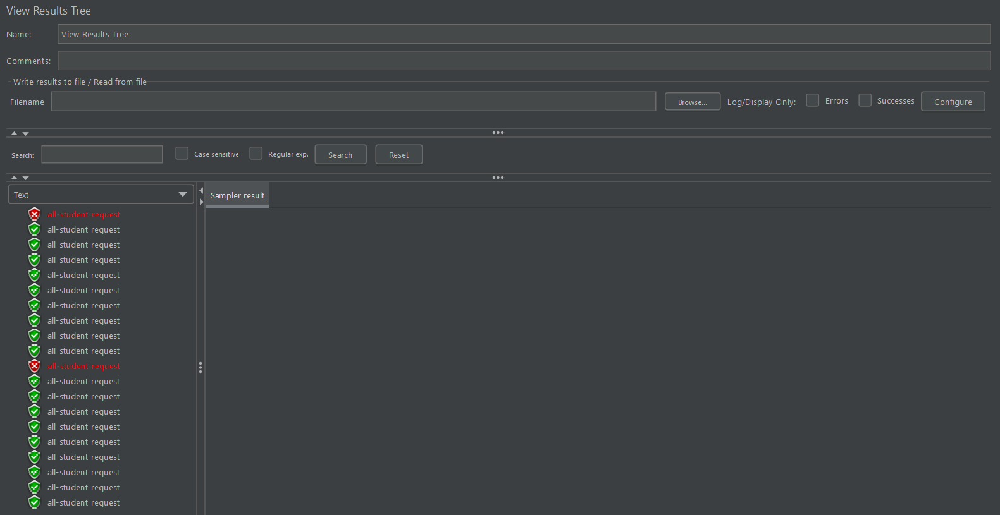
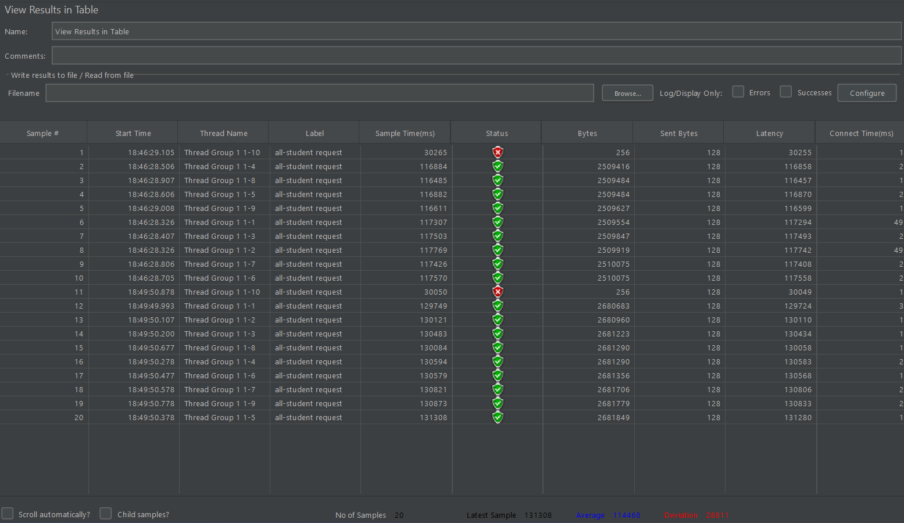
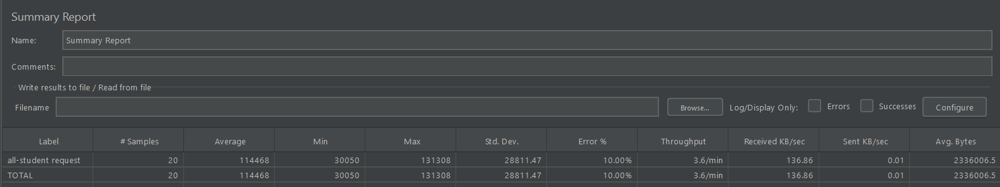
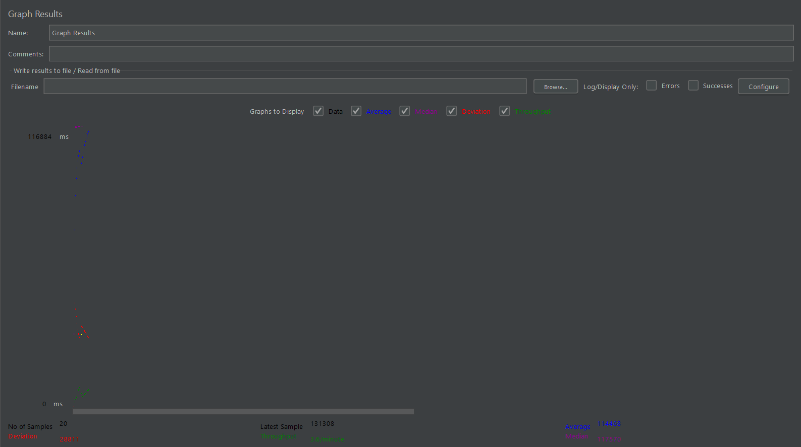
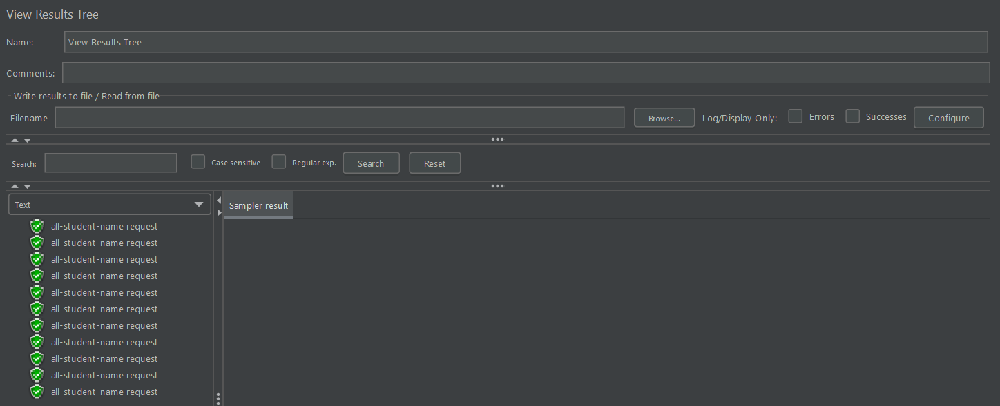
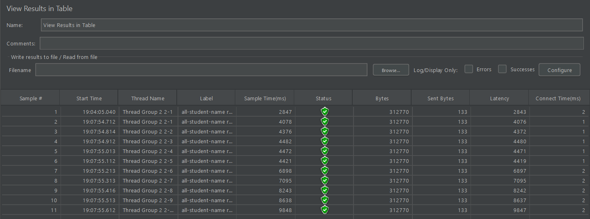
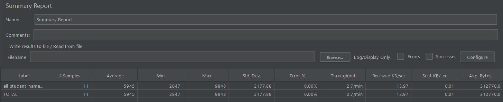
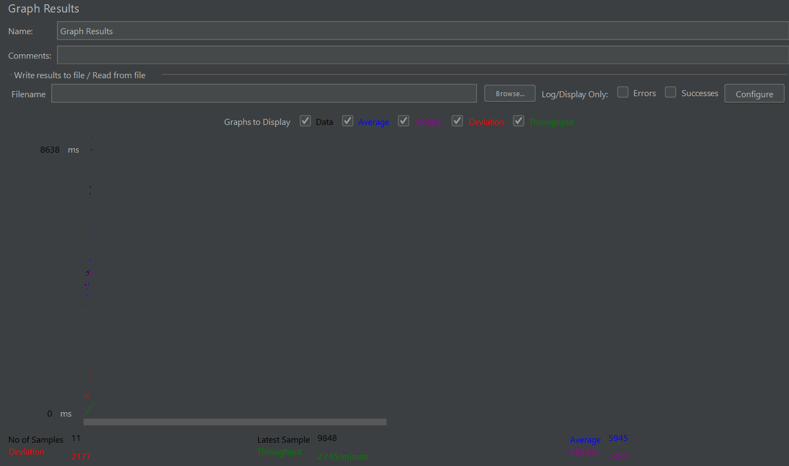
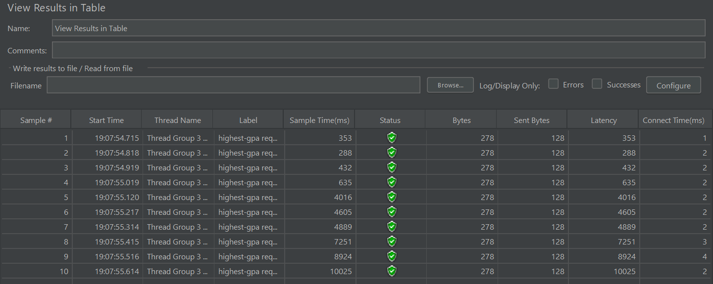
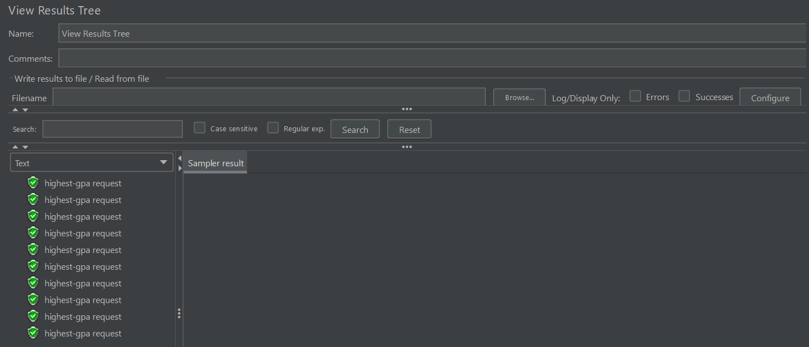
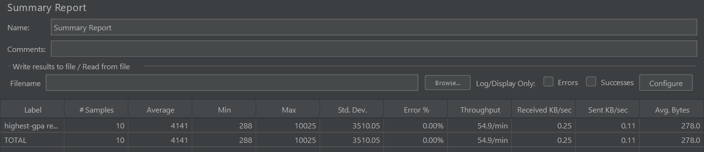
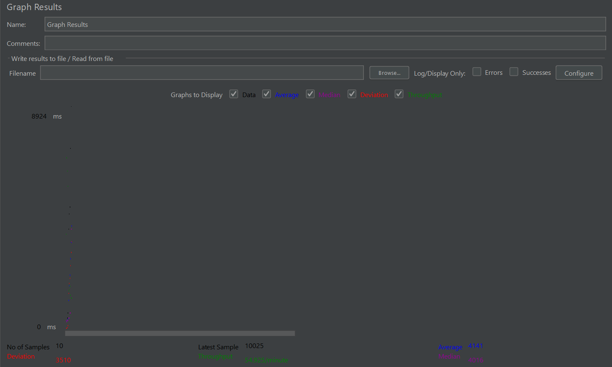

## CLI
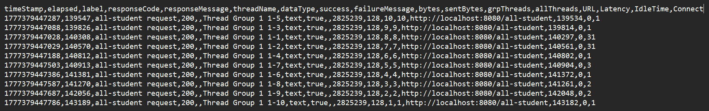
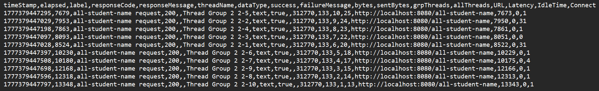
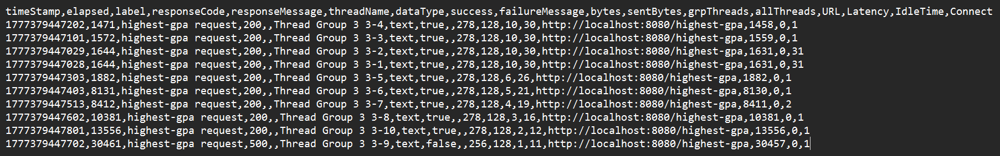

# Reflections
1. What is the difference between the approach of performance testing with JMeter and profiling with IntelliJ Profiler in the context of optimizing application performance?

    Answer: 

   Performance testing with JMeter focuses on simulating user load and measuring the overall performance of the application under different conditions, while profiling with IntelliJ Profiler allows developers to analyze the application's code execution in detail, identifying specific bottlenecks and areas for optimization. JMeter provides insights into how the application performs under stress, while IntelliJ Profiler helps pinpoint the exact lines of code that may be causing performance issues.

2. How does the profiling process help you in identifying and understanding the weak points in your application?

    Answer: 
    
    The profiling process helps identify weak points in the application by providing detailed insights into the execution of the code, such as CPU usage, memory consumption, and method execution times. By analyzing these metrics, developers can pinpoint specific areas of the code that are inefficient or resource-intensive, allowing them to focus their optimization efforts on those areas. This understanding enables developers to make informed decisions about how to improve the performance of their application effectively.

3. Do you think IntelliJ Profiler is effective in assisting you to analyze and identify bottlenecks in your application code?

    Answer: 

   Yes, IntelliJ Profiler is effective in assisting developers to analyze and identify bottlenecks in application code. It provides a comprehensive set of tools and visualizations that allow developers to see how their code is executing in real-time, making it easier to spot performance issues. The ability to drill down into specific methods and see their execution times helps developers understand where the bottlenecks are occurring and what might be causing them, ultimately leading to more efficient optimization efforts.

4. What are the main challenges you face when conducting performance testing and profiling, and how do you overcome these challenges?

    Answer: 

   One of the main challenges in performance testing and profiling is accurately simulating real-world usage scenarios, which can be difficult to replicate in a testing environment. To overcome this, developers can use a combination of tools and techniques, such as JMeter for load testing and IntelliJ Profiler for detailed code analysis. Another challenge is interpreting the results from profiling, as it can be overwhelming to sift through large amounts of data. To address this, developers can focus on key metrics and use visualizations provided by the profiler to identify patterns and trends that indicate performance issues. Additionally, ensuring that optimizations do not affect the application's functionality requires thorough testing and validation after making changes to the code.

5. What are the main benefits you gain from using IntelliJ Profiler for profiling your application code?

    Answer: 

   The main benefits of using IntelliJ Profiler include the ability to gain deep insights into the application's performance at a granular level, identify specific bottlenecks in the code, and understand how different parts of the application interact with each other. It also provides visualizations that make it easier to interpret the data and make informed decisions about where to focus optimization efforts. Additionally, IntelliJ Profiler integrates seamlessly with the development environment, allowing for a more efficient workflow when analyzing and optimizing code.

6. How do you handle situations where the results from profiling with IntelliJ Profiler are not entirely consistent with findings from performance testing using JMeter?

    Answer: 

   When results from profiling with IntelliJ Profiler are not entirely consistent with findings from performance testing using JMeter, it is important to analyze the context of both sets of results. This may involve looking at the specific scenarios being tested, the load conditions, and the metrics being measured. It may also be necessary to conduct additional tests or use other profiling tools to gather more data and gain a clearer understanding of the performance issues. Additionally, developers should consider factors such as caching, garbage collection, and external dependencies that may affect performance in different ways under varying conditions.

7. What strategies do you implement in optimizing application code after analyzing results from performance testing and profiling? How do you ensure the changes you make do not affect the application's functionality?

    Answer: After analyzing results from performance testing and profiling, I implement strategies such as refactoring inefficient code, optimizing algorithms, and improving resource management. To ensure that the changes made do not affect the application's functionality, I conduct thorough testing, including unit tests, integration tests, and regression tests. Additionally, I may use feature flags to enable or disable new optimizations in production gradually, allowing for monitoring and quick rollback if any issues arise. It is also important to involve stakeholders in the optimization process to ensure that any changes align with the overall goals of the application.

